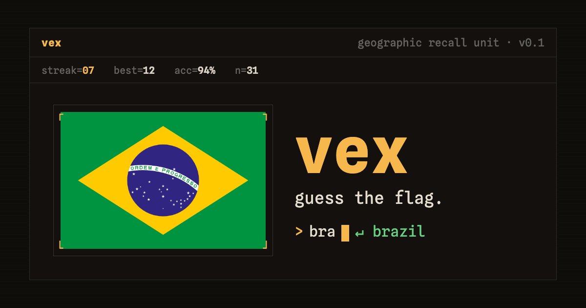

# vex

**`guess the flag.`** — a fast, terminal-styled flag quiz.

Type the nation, build a streak, beat your best.



## dev

```bash
bun install
bun dev
```

## build

```bash
bun run build
```

## stack

`react 19` · `vite` · `tailwind v4` · `typescript` · flags via [flagcdn](https://flagcdn.com)
